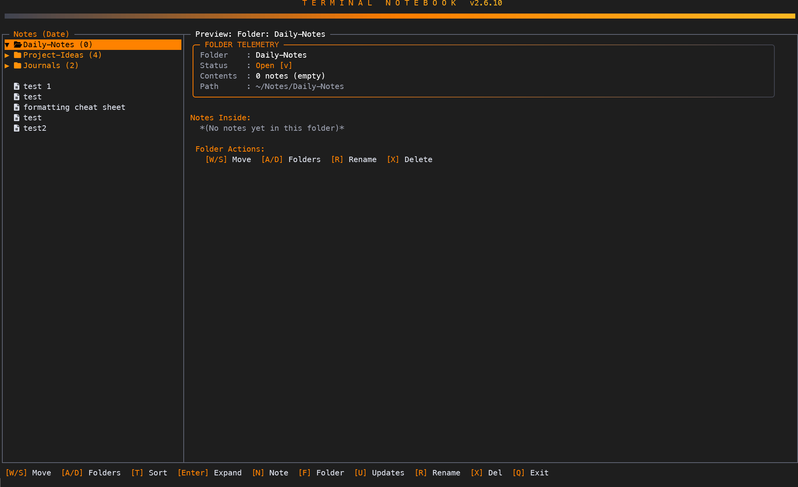
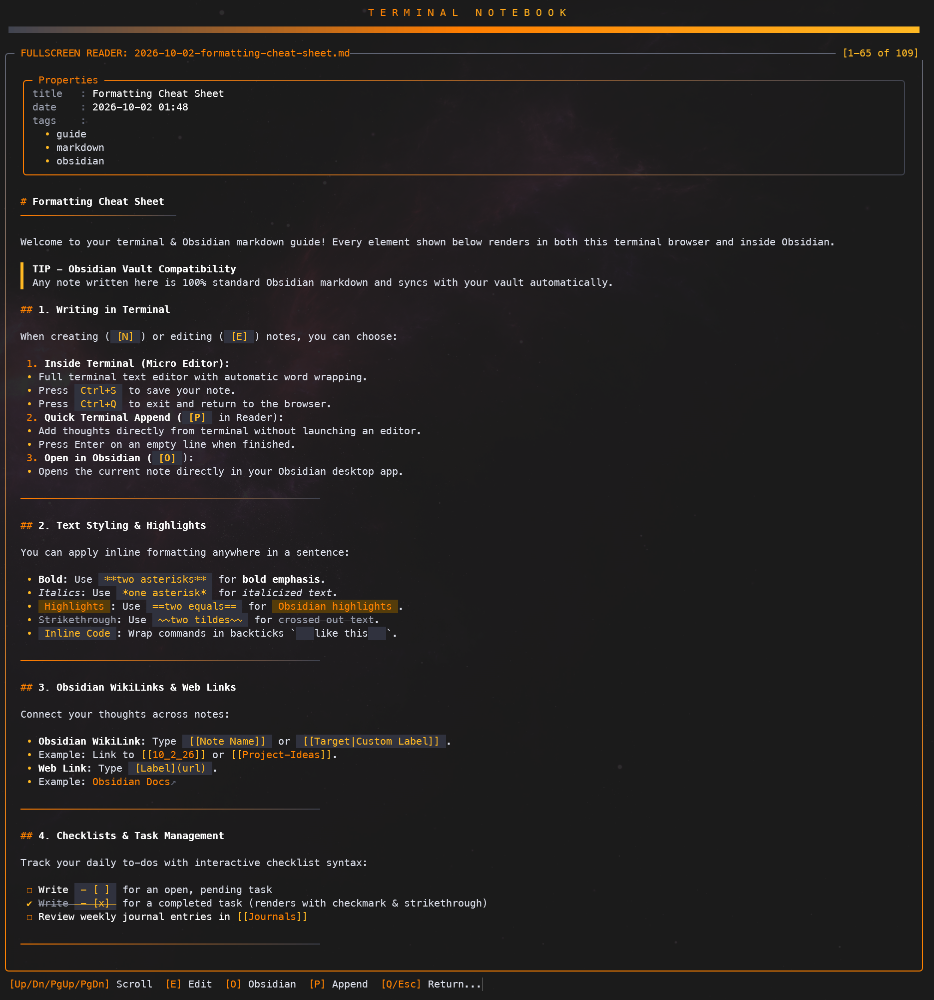

# Terminal Notebook

A blazingly fast, highly-aesthetic terminal-based notebook for browsing, writing, and organizing Markdown notes. It bridges the speed and workflow of the command line with the rich formatting and organizational power of modern note-taking apps like Obsidian.




## 🌟 Key Features

### 🖥️ Immersive Terminal UI
* **Notebook Browser:** An interactive, zero-flicker TUI (Text User Interface) with fluid navigation (`W/A/S/D` or Arrow Keys).
* **Sleek Aesthetics:** Features rounded outer app borders, top-to-bottom Gray-to-Orange vertical gradients, and solid dark slate floating cards.
* **Inline Floating Modals:** Actions like creating notes (`N`), creating folders (`F`), logging quick thoughts (`L`), renaming (`R`), and deleting (`X`) open floating popup cards directly over the browser interface.
* **Fullscreen Reader:** Press `V` or `Enter` to read notes in a distraction-free fullscreen view with built-in scrolling controls.



### 📝 Rich Markdown Engine
* **Native Markdown Rendering:** Renders raw Markdown into rich terminal output, including YAML frontmatter cards, Obsidian callouts (`> [!NOTE]`), fenced code blocks, tables, checklists (`- [x]`), wiki-links, and highlights (`==text==`).

### ⚡ Seamless Editing Workflows
* **Split-Pane Editing (Windows Terminal):** Creating or editing a note automatically splits your terminal side-by-side so your folder tree stays visible.
* **Editor Auto-Discovery:** Detects and launches your preferred terminal editor (`hx`, `micro`, `nvim`, `vim`, or `nano`).
* **Quick Logging:** Append passing thoughts directly to today's daily log straight from your terminal (`note "My quick thought"`).

### 📚 Multi-Notebook Workspaces
* **Instant Workspace Switching:** Seamlessly switch between separate notebook folders (e.g., Work vs. Personal) with `B` or straight from the command line (`note work`).

### 🌌 Deep Obsidian Integration
* **Obsidian Sync & Launching:** Auto-detects Obsidian vaults and lets you launch any note directly into Obsidian desktop with `O`.

---

## 🚀 Installation & Setup

### Prerequisites

* **PowerShell:**
  * **Windows:** Pre-installed (PowerShell 5.1+ supported, PowerShell 7+ recommended: `winget install Microsoft.PowerShell`).
  * **macOS:** Install PowerShell Core via Homebrew:
    ```bash
    brew install --cask powershell
    ```
* **Nerd Fonts:** Set your terminal font to any [Nerd Font](https://www.nerdfonts.com/) (e.g., *FiraCode Nerd Font*, *CaskaydiaCove Nerd Font*, or *MesloLGS NF*) for folder, file, and tree icons to render correctly.
* **Terminal Editor (Recommended):** Install a fast terminal editor like [Helix](https://helix-editor.com/) or [Micro]:
  * **Windows:** `winget install Helix.Helix`
  * **macOS:** `brew install helix`

---

### 📦 Installation & Setup

#### 1. Clone the Repository
Clone the repository to a folder on your system:
```bash
git clone https://github.com/jolobtw/Terminal-Notebook.git ~/Terminal-Notebook
```

#### 2. Create the `note` Alias for Your Shell

Select the instructions below for your operating system and preferred shell:

##### 🪟 Windows — PowerShell
1. Open your PowerShell profile in a text editor:
   ```powershell
   notepad $PROFILE
   ```
   *(If the file doesn't exist, create it with `New-Item -Type File -Path $PROFILE -Force`)*

2. Add the alias pointing to your `note.ps1` path:
   ```powershell
   Set-Alias -Name note -Value "C:\Path\To\Terminal-Notebook\note.ps1"
   ```

3. Reload your profile:
   ```powershell
   . $PROFILE
   ```

---

##### 🍎 macOS — zsh (Default macOS Shell)
1. Open your `~/.zshrc` file:
   ```bash
   nano ~/.zshrc
   ```

2. Add an alias that executes `note.ps1` using PowerShell (`pwsh`):
   ```bash
   alias note="pwsh -File $HOME/Terminal-Notebook/note.ps1"
   ```

3. Save, exit, and apply changes:
   ```bash
   source ~/.zshrc
   ```

---

##### 🍎 macOS / 🐧 Linux — PowerShell Core (`pwsh`)
If you use PowerShell as your primary shell on macOS or Linux:
1. Open your PowerShell profile:
   ```powershell
   pwsh -Command "notepad \$PROFILE"   # or nano ~/.config/powershell/Microsoft.PowerShell_profile.ps1
   ```

2. Add the alias:
   ```powershell
   Set-Alias -Name note -Value "$HOME/Terminal-Notebook/note.ps1"
   ```

3. Reload profile:
   ```powershell
   . $PROFILE
   ```

---

##### 🐧 Linux / 🍎 macOS — bash or fish
* **For bash (`~/.bashrc`):**
  ```bash
  alias note="pwsh -File $HOME/Terminal-Notebook/note.ps1"
  ```
* **For fish (`~/.config/fish/config.fish`):**
  ```fish
  alias note="pwsh -File $HOME/Terminal-Notebook/note.ps1"
  ```

---

#### 3. Launch Terminal Notebook!
Type `note` in your shell to open the interactive Notebook Browser:
```bash
note
```
*(On first launch, Terminal Notebook will automatically initialize your default workspace at `~/Notes` if one doesn't exist yet.)*

---

## 💻 CLI Commands & Usage

| Command | Action |
|---------|--------|
| `note` | Open interactive Notebook Browser in active workspace |
| `note <name\|path>` | Switch active workspace (e.g., `note work`) & launch browser |
| `note -Path <path>` | Launch directly into specific folder path |
| `note notebook list` | List all registered notebook workspaces |
| `note notebook switch <name\|path>` | Switch default active notebook workspace |
| `note notebook add <name> <path>` | Register a new notebook workspace |
| `note notebook remove <name>` | Remove notebook workspace from list |
| `note "quick thought"` | Quick log entry to today's daily log |
| `note new [title]` | Create a new Markdown note |
| `note list` | List all notes in current notebook with index numbers |
| `note view <#\|name>` | Open note in Fullscreen Reader |
| `note open` | Open active notebook folder in File Explorer / Finder |

---

## ⌨️ Keyboard Shortcuts

| Key | Action |
|-----|--------|
| `W/S` or `Up/Dn` | Move selection up or down |
| `A/D` or `L/R` | Expand or collapse selected folder |
| `C` or `Shift+A/D` | Expand or collapse ALL folders |
| `J/K` or `PgUp/PgDn` | Scroll through long file previews |
| `Enter` | Expand Folders / View Note |
| `V` | Open Note in Fullscreen Reader |
| `E` | Edit Note (Split-Pane Editor) |
| `O` | Open Note in Obsidian Desktop |
| `N` | Create a New Note |
| `F` | Create a New Folder |
| `L` | Quick Log Thought (Inline Modal) |
| `B` | Switch Notebook Workspace (Work, Personal, etc.) |
| `R` | Rename Item |
| `X` or `Del` | Delete Item |
| `U` | View App Updates / Release Notes |
| `T` | Toggle Sorting (A-Z vs Date Modified) |
| `Q` or `Esc` | Exit |


